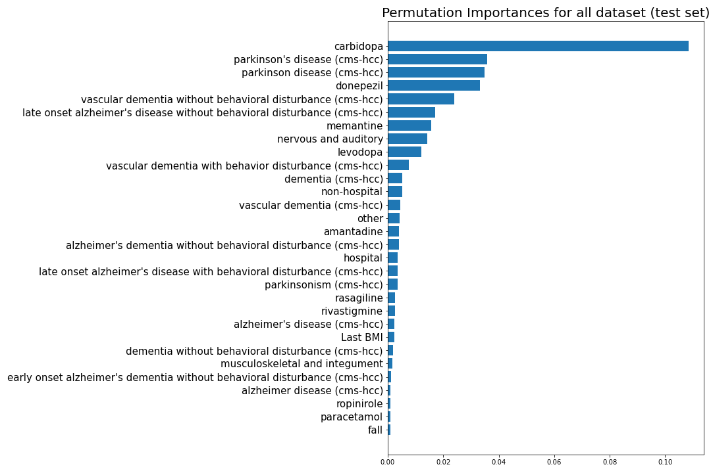

# Predictive model for dementia based on electronic medical records

## Introduction

Approximately 5.5 million Americans age 65 or older suffer from Alzheimer’s disease, and this number is expected to more than double by 2050 [1]. Correctly distinguishing AD from other types of dementia is critical for development of AD treatments. Several neuroimaging techniques exist for accurate diagnosis of AD [2, 3], but these techniques are expensive and invasive. Previous studies [4] have demonstrated that multiple factors (e.g., heart disease, diabetes, obesity, smoking, and hypertension) are common among individuals with AD. As such, it might be possible to distinguish individuals with AD from others based on their health status. 

Here, I aimed to develop a machine-learning model to classify individuals with different sub types of dementia (e.g., Alzheimer’s disease, AD; Lewy Body Dementia, LBD, Frontotemporal Dementia, FTD; Vascular Dementia; VD, or Parkinson's disease; PD) based on their general health history. My central hypothesis was that routine care data, which is widely available through electronic medical record, can be used to predict subtypes of dementia. In terms of the expected outcomes, I anticipate that the noted machine-learning models will enable us to predict subtypes of dementia with a high accuracy, and allow us to introduce a cost-effective screen tool for diagnosis of dementia. 

## Methods

### Data

To achieve the aim of this project, I used structured and simi-structured data (i.e., diagnosis, prescriptions, and medical notes).After getting approval for the HFHS IRB, I collected medical records of 40000 patients from the HFHS's electrical medical records (called EPIC). This dataset includes records of several patients with healthy individuals, AD, PD, VD, FTD, and LBD. Among these recorders, I only kept those with disease lists. I also decided to remove records for patients with FTD, and LBD becuase the number of recorded were too small (less than 300). My final dataset included 18402 records. This dataset includes the following information: 
1. Gender (categorical)
2. Last Bold pressure (D; numerical)
3. Last Bold pressure (S; numerical) 
4. Smoking status (categorical)
5. problem lists and diagnoses (free text) 
6. Medications (free text)

### Patients characteristics

The final dataset includes records of 18402 patients. These patients are categorized into 5 different classes as follows:  healthy, AD, VD, and PD (Fig. 1)  

 </em>

*Fig 1. # of patients in each class.*

Based on our dataset, most of the patients are non-smokers (Fig. 2-left). Also, our dataset included more females than males, except for the PD class (Fig. 2-right).

 </em>

*Fig 2. Distribution of patients based on gender (right), and smoking status for each class.*

### Feature Engineering

To prepare data for developing ML models, I first had to use NLP methods to vectorize the free texts. Since pharmaceutical companies use different names for the same medication, I had to find the original name of each of them. Xu, et al. [5] developed an NLP Java-based tool (MedEx) to extract the name of the medications. I modified a python warper (pymedex) [6] to use the MedEx tool to extract the name of all of the listed medications for each of the records. This process was very successful. To show the outcome of the tool, I showed the top 8 frequent medications for each class (Fig 3).

 </em>

*Fig 3. Top 8 medications for each class*

I also use NLP methods to extract the name of diagnoses and health-related problems for each patient. For this purpose, I tokenized the free texts of the problem lists and made a bag of phrases for each record. I finally used sklearn to vectorized the medications and problem lists. It is worth noting that I dropped medications and problems that their frequency was less than 30. To show the outcome of this process, I showed the top 10 frequent problems for each class (Fig 4).

Fig 4. Top 10 problems for each class </em>

 In the next step, I created dummy variables based on the categorical variables. I finally imputed the null values for the numerical variables based on their means. My final data table included 1551 features. 

### ML techniques

#### Detecting leaky features

At the first step to developing the ML, I used trained two different classifiers (i.e., Random Forest Classifier and Gradient Boosting). After splitting the dataset to train and test sets,  I used the Randomized grid search method to find the optimal parameters for each classifier and trained the final models with the optimal parameters. The accuracy of the model was 0.77. This score implies that my model performs well for predicting different types of dementia. However, this model might have leakage because the dataset may include some medications and keywords that are used specifically for any of the targeted dementia. As such, I computed the permutation importance to explore whether I have any potential leaky features. As expected, some of the top permutation importance (Fig. 4) are related to the targeted classes. Based on the permutation importance and looking at the medical references, I identified the tope important features that were leaky and dropped from the model.

 </em>

*Fig 4. Top 10 problems for each class.*

### Final ML models

In the next step, I split the new dataset to train and test sets and performed the Randomized grid search method to find the optimal parameters for each classifier. The results of each of the model are summarized in Table 1. As you can see, the accuracy score has been dropped since I have dropped the leaky featuters.

Table 1. Summary scores of the different ML models

|Model|accuracy|One-vs-One ROC AUC scores|weighted by prevalence_OVO|macro_roc_auc_ovr|weighted by prevalence_ovr|
|----:|-------:|------------------------:|-------------------------:|----------------:|-------------------------:|
|    RF|  0.6107|                   0.7942|                    0.8039|           0.8043|                    0.8248|
|    GB|  0.6427|                   0.8139|                    0.8248|           0.8259|                    0.8464|

To further explore the performance of the models, I plotted ROC for both models (Fig. 5). Based on this ROC, the performance of the GB-based model is slightly better than the RF. As such, I mainly focus on the former one (GB).

  </em>

 

*Fig 5. ROC for the RF and GB models.*

The ROC of the GB for different classes (Fig. 6) showed that the model had a better performance to detect healthy individuals vs the rest of the classes. Also, AUC for AD and PD classes are relatively high. The model had a poorer performance to detect VD vs. the rest of the classes. One reason for this observation is that I had a smaller dataset for the VD class.

  </em>

*Fig 6. ROC for the GB model.*

The confusion matrix also supported the above argument related to the ROC of the GB model.

## Conclusion

This report is a preliminary study to investigate whether we are able to detect patients at risk of dementia. The results of the developed model are promising and indicate that medical records are potentially useful for identifying patients with dementia. However, further investigations are needed to develop more robust models by including larger datasets and using a more advanced model.

## References
[1] L.E. Hebert, J. Weuve, P.A. Scherr, D.A. Evans, Alzheimer disease in the United States (2010–2050) estimated using the 2010 census, Neurology 80(19) (2013) 1778-1783. http://n.neurology.org/content/neurology/80/19/1778.full.pdf.

[2] R. Wurtman, Biomarkers in the diagnosis and management of Alzheimer’s disease, Metabolism 64(3, Supplement 1) (2015) S47-S50. http://www.sciencedirect.com/science/article/pii/S0026049514003436.

[3] R.A. Sperling, P.S. Aisen, L.A. Beckett, D.A. Bennett, S. Craft, A.M. Fagan, et al., Toward defining the preclinical stages of Alzheimer’s disease: Recommendations from the National Institute on Aging-Alzheimer's Association workgroups on diagnostic guidelines for Alzheimer's disease, Alzheimer's & Dementia 7(3) (2011) 280-292. http://www.sciencedirect.com/science/article/pii/S1552526011000999.

[4] A.s. Association, 2018 Alzheimer's disease facts and figures, Alzheimer's & Dementia 14(3) (2018) 367-429.

[5] Xu, Hua, et al. "MedEx: a medication information extraction system for clinical narratives." Journal of the American Medical Informatics Association 17.1 (2010): 19-24.

[6] https://github.com/bran-williams/pymedex

